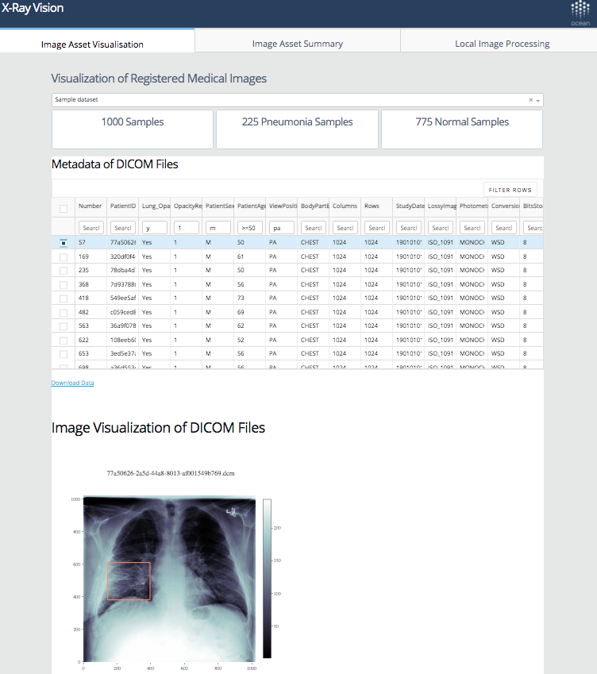
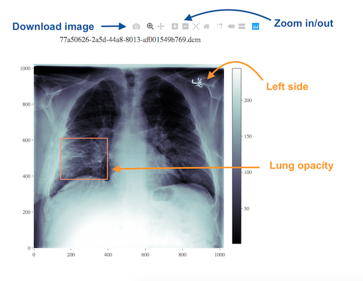

[](https://oceanprotocol.com)
------

## X-Ray Vision App for Medical Image Visualization

#### App URL https://x-ray-vision.herokuapp.com

  

<br>

### 1. Functions
#### Tab 1: Visualization of registered medical images
  * Visualization of DICOM images
  * Lung opacity annotation (regions in orange bounding boxes)
  * Summary of image metadata  

   

#### Tab 2: Summary graphs of registered medical images

#### Tab 3: Processing of local medical images
  * Visualization of DICOM images
  * Metadata extraction of DICOM images
  * **Two approaches:**
    * Users can upload one DICOM image and download results (.png and .csv)
    * On-premise use of the app to process multiple DICOM images (Session 2)

<br>

---
### 2. On-premise use of the app
  * Run the app locally

```
# 1) Open your terminal and clone the repository  
git clone https://github.com/oceanprotocol/lungfish.git

# 2) Copy your DICOM (.dcm) files to 'localpathto/lungfish/app/data/local_image/'

# 3) Run the app in your terminal
cd lungfish/app
pip install -r requirements.txt
python index.py
```

  * Visualization of medical images

```  
# 4) Visit http://127.0.0.1:8050/ in your browser

# 5) Click the tab 'Local Image Processing'
# 5.1) Choose "On-premise run"
# 5.2) The metadata of all your local dcm files are automatically summarized in the table
# 5.3) Click a row and visualize a DICOM file
```

<br>
---
### 3. Built with
  * Dataset: a pneumonia sample dataset from NIH Clinical Center (1000 DICOM images)
  * [Dash](https://dash.plot.ly/) - Main server and interactive components
  * [Plotly Python](https://plot.ly/python/) - Used to create the interactive plots  
  * Deployed with [Heroku](https://devcenter.heroku.com/articles/heroku-cli#download-and-install)

```
# 1) Install heroku  
# Mac:
brew tap heroku/brew && brew install heroku

# Linux:
sudo snap install --classic heroku

# 2) Login in to Heroku
heroku login

# 3) Create an app on Heroku by assigning an app name 'x-ray-vision', the buildpack, and region
cd lungfish/app
heroku create x-ray-vision --buildpack heroku/python --region eu

# 4) Check git remote
git remote -v  

# 5) Deploy the app to Heroku
git add .
git commit -m 'initial commit'
git push heroku master

# 6) Start the app
heroku ps:scale web=1

# 7) Visit the app website
https://x-ray-vision.herokuapp.com/
```

<br>

---
### 4. Reference  
[dash-salesforce-crm](https://github.com/plotly/dash-salesforce-crm)
